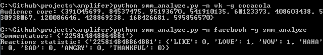

# Амплифер. Инструмент для SMM аналитики социальных сетей: Facebook, Instagram, VK

[Instagram](https://www.instagram.com/)

Подсчет статистики для пользователей, комментировавших 5 последних постов группы, за последние 3 месяца. 
Вывод в терминал двух рейтингов:
1. Общее количество комментариев по аккаунтам;
2. Число откомментированных аккаунтом постов.

[ВКонтакте](https://vk.com/)

Вывод в терминал ядра аудитории - список ID аккаунтов пользователей, откомментировавших и лайкнувших один из постов, за последние 2 недели.

[Facebook](https://www.facebook.com/) запретил исследовать чужие группы. Доступно исследование только собственной группы.

Вывод в терминал:
1. Список аккаунтов комментаторов;
2. Статистика по эмоциям.


### Как установить

Для использования скрипта необходимо:

1. Создать приложение  [ВКонтакте](https://vk.com/). Создать приложение можно в разделе [Мои приложения](https://vk.com/apps?act=manage). В качестве типа приложения следует указать `standalone` — это подходящий тип для приложений, которые просто запускаются на компьютере.
2. Получите сервисный ключ доступа `access token` в настройках Вашего приложения [ВКонтакте](https://vk.com/). Сервисный ключ доступа идентифицирует Ваше приложение. Все запросы к API, совершённые с использованием Вашего ключа доступа, будут считаться совершёнными от имени Вашего приложения.
3. Для работы с Facebook API нужен ключ доступа `access token` (маркер доступа пользователя). Получите ключ с правами `groups_access_member_info, manage_pages, pages_show_list, publish_pages, publish_to_groups` - [инструкция](https://developers.facebook.com/docs/graph-api/explorer/). Продлите [ключ доступа с 2-х часов до 2-х месяцев](https://developers.facebook.com/tools/debug/accesstoken/).

Скрипт берет часть данных из переменных окружения. Чтобы их определить создайте файл `.env` рядом с `manage.py` и запишите туда данные в таком формате: `ПЕРЕМЕННАЯ=значение`.

Доступны следующие переменные:
- `FACEBOOK_USER_ID` - ID аккаунта пользователя [Facebook](https://www.facebook.com/)
- `FACEBOOK_ACCESS_TOKEN` - ключ доступа [Facebook](https://www.facebook.com/)
- `INSTAGRAM_LOGIN` — логин [Instagram](https://www.instagram.com/) аккаунта
- `INSTAGRAM_PASSWORD` — пароль от [Instagram](https://www.instagram.com/) аккаунта
- `VK_ACCESS_TOKEN` - ключ доступа [ВКонтакте](https://vk.com/)


Python3 должен быть уже установлен. 
Затем используйте `pip` (или `pip3`, если есть конфликт с Python2) для установки зависимостей:
```
pip install -r requirements.txt
```

### Аргументы

* `network_name` — название социальной сети;
* `group_name` — название группы для анализа.


### Как запустить

Пример команды запуска: 
`python smm_analyze.py --network_name vk --group_name cocacola`

Сокращенный вариант: `python smm_analyze.py -n vk -g cocacola`

Пример результата для VK и Facebook: 



### Цель проекта

Код написан в образовательных целях на онлайн-курсе для веб-разработчиков [dvmn.org](https://dvmn.org/).